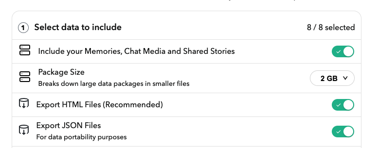

# Snapchat Memory Exporter
Snapchat's standard memories export is **lossy** since the filters and time associated with each memory are separate from the raw media (mp4/jpg). This script combines the raw media with its corresponding overlay (filter), and preserves the memory's time (for time-sorted viewing on Finder / Google Photos / etc.).

To export your Snapchat Memories:

1. Request your data from snapchat at this [link](https://accounts.snapchat.com/accounts/downloadmydata).
Make sure to select "Include your Memories..." and "Export HTML Files".



2. Once Snapchat emails you, download the memory zips at this [link](https://accounts.snapchat.com/accounts/downloadmydata).
This will give you a number of zip files (mydata~*.zip) on your machine. After unzipping, you should have a file structure like so (I created the snapchat-downloads folder, moved the zips to that folder, and then unzipped and deleted the zips):

```
snapchat-downloads
├── mydata~1699150876044
│   ├── chat_media
│   ├── html
│   ├── index.html
│   ├── json
│   └── memories
├── mydata~1699150876044-1
│   ├── chat_media
│   └── memories
└── mydata~1699150876044-2
    ├── chat_media
    └── memories
```
3. Install Python requirements

```bash
pip install -r requirements.txt
```

4. Export your snapchat memories!

```bash
python snapchat_export.py ./snapchat-downloads 
```

or specify an output folder, instead of using the default `./output`.

```bash
python snapchat_export.py ./snapchat-downloads --output_folder "snap-memories" 
```